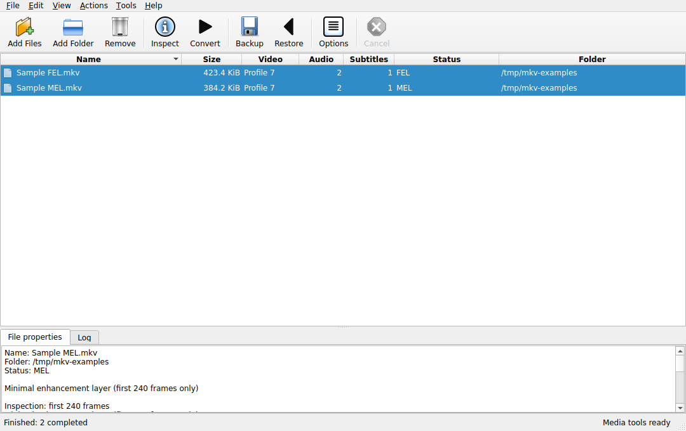
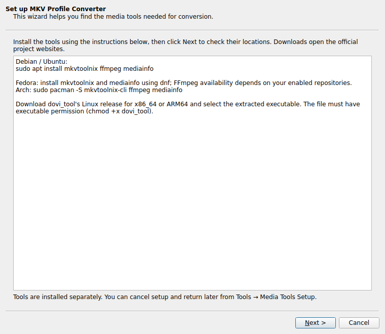
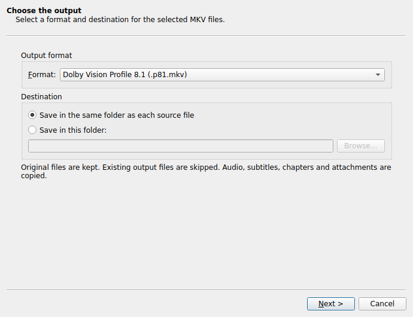

# MKV Profile Converter

**Dolby Vision Profile 7 → Profile 8.1. Keep your audio and subtitles.**

A native desktop app for converting **Dolby Vision Profile 7 MKVs to Profile 8.1 MKVs**, preserving audio, subtitles, timing, chapters and attachments. Built with Python and Qt/PySide6 for macOS, Linux and Windows. Windows runs natively; WSL is not required.

This is an independent project, not affiliated with, sponsored by, or endorsed by Dolby. Dolby and Dolby Vision are trademarks of Dolby Laboratories Licensing Corporation. Format names identify the media the app processes; they do not indicate Dolby certification.



## Start here

1. Download the source ZIP from GitHub (**Code → Download ZIP**) and extract it into a writable folder, or clone the repository.
2. Install **Python 3.10 or newer** if it is not already installed.
3. Run the launcher for your OS:

| OS | Launcher | Terminal alternative |
|---|---|---|
| macOS | `Start.command` | `python3 launch.py` |
| Windows | `Start.bat` | `py -3 launch.py` |
| Linux | `Start.sh` | `python3 launch.py` |

The first launch downloads Qt into a private `.venv` inside the extracted project. Subsequent launches reuse it. If macOS does not allow opening the command file, use the Terminal alternative from the project folder. Linux distributions may require their `python3-venv` package. The source folder must remain in place.

You can also run a native distribution built with `scripts/build.py`; those distributions include Python and Qt and do not use the launchers. Media tools are installed separately in either case.

## Installable builds

The build workflow includes a Windows setup EXE and a macOS Installer PKG, in addition to portable archives. They include Python and Qt. Windows setup offers a destination, Start-menu shortcut, optional desktop shortcut, and uninstaller; it installs for the current user. The macOS package uses Apple's Installer to place the app in `/Applications`. Linux uses the portable TAR.GZ.

Linux and Apple Silicon macOS distributions have been built. The macOS 0.2.0 test build passed 33 unit/GUI tests, package installation, and native Cocoa startup on macOS 15.7.9. Windows and Intel macOS builds have not been executed. Installers have no Developer ID signature or notarization; the macOS app has PyInstaller's ad-hoc signature. Media executables are installed separately through their official projects; the in-app setup wizard locates and validates them.



## Set up media tools

Open **Tools → Media Tools Setup**. Setup also opens automatically at startup when required tools are missing. The app checks actual executable versions and lets you browse to each program. Use executables appropriate for the CPU and OS; the app reports execution errors and unsupported versions.

| Tool | Required | Minimum | Role |
|---|---|---|---|
| dovi_tool | Yes | 2.3.4 | Metadata inspection, P7→P8.1, HDR10, layer demux/mux |
| mkvmerge | Yes | 67 | Identify containers and remux tracks |
| mkvextract | Yes | 67 | Extract source video and precise timestamps |
| FFprobe | FFprobe **or** MediaInfo | 5 | Profile and compatibility detection |
| MediaInfo | FFprobe **or** MediaInfo | 22 | Profile detection and MaxCLL metadata |
| FFmpeg | Optional, recommended | 5 | Streaming conversion and compressed audio/subtitle hashes |

**macOS — Homebrew**

```bash
brew install dovi_tool mkvtoolnix ffmpeg media-info
```

Both `/opt/homebrew/bin` (Apple Silicon) and `/usr/local/bin` (Intel) are searched, including when the packaged app is launched from Finder with a restricted PATH. MKVToolNix's `.app` installation and custom executable paths are also supported.

**Windows — native tools**

```powershell
winget install --id MoritzBunkus.MKVToolNix -e
winget install --id Gyan.FFmpeg -e
winget install --id MediaArea.MediaInfo -e
```

Download the appropriate Windows ZIP from [dovi_tool releases](https://github.com/quietvoid/dovi_tool/releases). Extract it and select `dovi_tool.exe` in Media Tools Setup. Program Files, WinGet links, Scoop shims, PATH and manually selected paths are searched. Choosing `mkvmerge.exe` also makes adjacent `mkvextract.exe` discoverable; the same applies to FFmpeg/FFprobe. Some packages use versioned locations, so use Browse if automatic detection cannot find them.

**Linux — Debian/Ubuntu**

```bash
sudo apt install mkvtoolnix ffmpeg mediainfo
```

Download dovi_tool's Linux release for x86_64 or ARM64, extract it, make it executable, and select it in Media Tools Setup. Other distributions' package-manager guidance appears in the app. Distro packages older than the minimum need upgrading. Desktop Qt additionally requires the system graphics/windowing libraries appropriate to X11 or Wayland; minimal servers may not have those installed.

## Convert

1. Click **Add Files** or **Add Folder**, or drop MKVs into the file list. Folder discovery skips generated `.p81.mkv`, `.hdr10.mkv` and `.restored.mkv` files.
2. Select files with the usual click, Shift-click, and Ctrl-click (Command-click on macOS). **Edit → Select All** selects the whole list. Sorting columns does not change which files are selected.
3. **Inspect** (F6) checks the first 240 metadata frames. **Actions → Full Inspection** (F7) checks the complete metadata. Double-click a file for its properties.
4. Click **Convert** (F9). The wizard walks through **Output → Options → Review → Conversion**. Use Back and Next to review settings, then Convert to start. The final page shows progress, logs and the outcome. Cancel waits for tool shutdown and cleanup before enabling Finish.
5. **Tools → Options** changes the defaults. Disk extraction is the default; streaming needs FFmpeg. A layer backup uses disk extraction even when streaming was selected. Each conversion performs a full inspection before processing.

The interface uses standard Qt desktop widgets, the platform's default style and system colors. It has a menu bar, labeled toolbar icons, compact sortable columns, a properties/log pane, context menus and keyboard shortcuts. No custom palette, web-style sidebar or stylesheet is applied.



The output is `Movie.p81.mkv` or `Movie.hdr10.mkv`. Originals are not renamed, modified or deleted. Existing output files are skipped. With a destination folder, folder imports preserve the imported root name and its subfolder layout. File-only imports use the selected destination directly.

Full-file operations are sequential to avoid saturating the disk. The interface stays responsive; progress reports stages and tool-reported percentages. It is not a byte-accurate estimate of remaining runtime. Cancel terminates active tools and cleans the application's temporary directories. Already completed files remain available.

**File** also contains file-list save/load, CSV result export, log export, and opening the selected output folder. **Remove** only removes entries from the list; it never deletes media files. Queue files preserve source paths and selection, not a persistent conversion checkpoint; an interrupted file restarts from the beginning.

## What is preserved and verified

- HEVC base video is not re-encoded. dovi_tool converts the metadata and drops the enhancement layer.
- All audio and subtitle tracks are copied by MKVToolNix, including their language, names, order and selection flags.
- Source video presentation timestamps, including its initial offset, are extracted and reapplied; frame counts and timestamps are checked afterward. No frame-rate guessing is used.
- Chapters and attachments are copied. Their inventory and chapter count are checked. Video track tags are reassociated with the new video track; obsolete stream-statistics tags are regenerated by MKVToolNix.
- Output must advertise the expected Dolby Vision profile and HDR10 compatibility for P8.1. Output RPU count must match its video frame count.
- When enabled and FFmpeg is available, SHA-256 hashes of compressed audio and subtitle stream payloads must match. This performs additional full-file reads. Without FFmpeg, the app explicitly logs that payload hashing is unavailable; inventory and timing checks still run.
- Each output is verified in a private staging directory on the destination filesystem, then published without replacing an existing file. The source's identity, size and modification time are checked before publication.

Mkvmerge's warning exit code is handled separately from fatal errors, and warnings are recorded in the log. Failed or unverifiable conversions are not published. A source on a read-only drive is supported if the selected output and temporary folders are writable.

## MEL, FEL and brightness checks

Profile 7 may use a minimal (MEL) or full (FEL) enhancement layer. P8.1 keeps the base image plus converted dynamic metadata; it cannot retain the original FEL picture contribution through a metadata-only conversion.

The app follows dovi_convert's L1-versus-base-MaxCLL brightness heuristic, with a 50-nit margin, but uses a full metadata pass before conversion. This is **not proof of visually lossless conversion**. MaxCLL can be inaccurate, and FEL can contain other picture detail even without detected brightness expansion.

- MEL is eligible by default.
- FEL with no detected brightness expansion requires **Include FEL files without detected brightness expansion**.
- Missing brightness data, unrecognized layer types, or detected expansion require **Allow complex or uncertain FEL files** under Advanced. This override is not saved across app restarts.
- Missing metadata frames or timing mismatches are hard failures even with the override.

There is no fallback that silently discards tracks or changes the requested output to SDR.

## Enhancement-layer backups and restore

Enable **Create enhancement-layer backup** during conversion, or click **Backup** to archive a Profile 7 source separately. Click **Restore** to select a converted MKV and its matching archive. The `.dovi` archive is an uncompressed TAR containing `el.hevc` and `manifest.json`.

The manifest records SHA-256 fingerprints of the extracted base video and enhancement layer, and the video frame count. Restoring requires the corresponding unchanged P8.1/HDR10 MKV. A wrong base video or damaged archive is rejected. Restore produces a new `.restored.mkv`; it reconstructs Profile 7 video and carries the converted MKV's other tracks forward. It does not reproduce the original container byte for byte.

Legacy dovi_convert `.dovi` files containing only `el.hevc` are supported with the explicit legacy checkbox. They lack a base-video fingerprint, so correct pairing is your responsibility; frame counts and the restored output profile are still verified. Archive members are never blindly extracted and links are rejected.

## Space and compatibility

The app estimates disk requirements before starting. Disk mode may need about three source-file sizes of free space across work/output drives; backup/restore can need more. Streaming generally needs less. Estimates are conservative, particularly when most of a source file is audio. Choose a spacious temporary folder in Advanced for large remuxes.

The core currently supports **one HEVC video track in an MKV**. Separate-track BL/EL encodings, multiple video angles, Profile 5, and authoring Dolby Vision from SDR/HDR10 are outside this app's conversion scope. It supports HDR10 extraction from Profile 7, not arbitrary SDR tone mapping. Display compatibility still depends on the player and TV.

Filesystem file-size limits (for example FAT32's 4 GiB limit), OS permissions, or insufficient space may prevent saving large files. The app keeps the source intact on failure. An OS crash during the final publication step can leave a zero-byte reserved output; inspect and remove that empty reservation before retrying.

## Build native apps

Build on **each target OS and CPU architecture**. PyInstaller does not cross-compile a macOS `.app` or Windows `.exe` from Linux.

```bash
python -m pip install -r requirements.txt -e ".[dev]"
python scripts/build.py --archive
# Windows or macOS, after the app build:
python scripts/build_installer.py
```

- macOS: `dist/MKVProfileConverter.app` and a ZIP made with `ditto` to retain framework symlinks.
- Windows: `dist/MKVProfileConverter/MKVProfileConverter.exe` plus its runtime directory and ZIP.
- Linux: `dist/MKVProfileConverter/MKVProfileConverter` plus its runtime directory and a TAR.GZ retaining symlinks.

Windows installer builds additionally require [Inno Setup 6](https://jrsoftware.org/isinfo.php); macOS uses `pkgbuild`. The CI workflow installs Inno Setup automatically.

Distribute the complete directory/bundle. Media tools are external and can be placed in a `tools` folder next to the executable, or selected in Media Tools Setup. Packaged subprocesses restore the system library-search environment, preventing bundled Qt libraries from overriding those needed by installed media tools.

`.github/workflows/build.yml` runs unit/GUI tests, native app builds for Linux/macOS/Windows, and installer builds for Windows/macOS on pushes to `main`, version tags, pull requests, and manual runs. Completed runs provide downloadable build artifacts in the repository's **Actions** tab without publishing a release. Public distribution should add your own Apple signing/notarization and Windows signing; no signing credentials are included.

## Development and validation

```bash
python -m pip install -r requirements.txt -e ".[dev]"
python -m pytest -m "not integration" -q
python scripts/make_test_fixture.py
# macOS/Linux:
export DOVI_TEST_FIXTURE="$PWD/.testdata/Sample MEL.mkv"
export DOVI_TEST_FEL_FIXTURE="$PWD/.testdata/Sample FEL.mkv"
python -m pytest -q
```

For Windows PowerShell set `$env:DOVI_TEST_FIXTURE` and `$env:DOVI_TEST_FEL_FIXTURE` to the corresponding absolute fixture paths. Tests write outputs in temporary folders.

See [VALIDATION.md](docs/VALIDATION.md) for what was actually executed. The Apple Silicon macOS test build is available from [this successful GitHub Actions run](https://github.com/julio-am/mkv2dv8/actions/runs/36641162951). Windows, Intel macOS, and signed/notarized installer validation remain outstanding. Test footage is small synthetic material and is not a substitute for verifying a representative full-length title on your own player before doing a large batch.

See [FEATURES.md](docs/FEATURES.md) for the scope relative to dovi_convert, and [NOTICE.md](NOTICE.md) for licenses and upstream credits.
